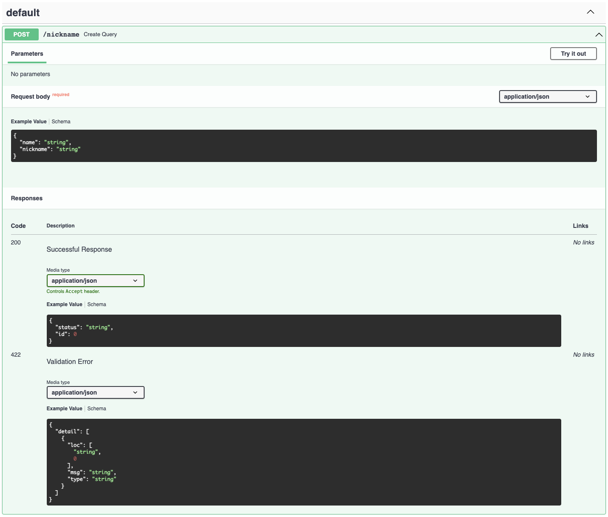

[Github](https://github.com/Aiden-Jeon/mle-mlops/tree/main/03_api) 에서 해당 내용에 대해서 확인할 수 있습니다.

## Overview
### 목표

- 앞서 작성한 API 코드를 pydantic을 이용해 작성합니다.

### 요구사항

1. 앞서 작성한 Create API를 Path Parameter로 작성합니다.
2. Create API에서 입력으로 받아야 하는 값들을 `pydantic.BaseModel` 로 수정합니다. [[Request Body](https://fastapi.tiangolo.com/tutorial/body/)]
    - `Class CreateIn(BaseModel):`
3. create 함수를 수정합니다. [[Use the model](https://fastapi.tiangolo.com/tutorial/body/#use-the-model)]
4. create 후 반환하는 값을 Response Model로 수정합니다. [[Response Model](https://fastapi.tiangolo.com/tutorial/response-model/)]
    - `Class CreateOut(BaseModel):`
    - status, id 를 반환합니다.
        - id는 memory에 들어있는 length를 반환합니다.
        - eg) 첫 번째 입력값의 id는 0입니다.
5. create 함수의 반환 값을 ResponseModel로 수정합니다.
6. Pydantic으로 작성하기 전과 후의 api의 차이점을 비교합니다.

---

## 구현
### Pydantic

pydantic을 이용해 create api 에서 받을 입력 스펙과 출력 스펙을 정의합니다.

입력으로 받을 정보는 `name`과 `nickname`입니다.
```python
from pydantic import BaseModel


class CreateIn(BaseModel):
    name: str
    nickname: str
```

생성 후 전달할 정보는 `status`와 `id` 입니다.
```python
class CreateOut(BaseModel):
    status: str
    id: int
```

### api
위에서 정의한 schema를 이용해 api 코드를 작성합니다.

데코레이터의 `response_model` 에 `CreateOut`을 입력합니다.  
입력으로 받은 값을 `create_in` 으로 정의하고 type hint로 `CreateIn`을 입력합니다.  
입력으로 받은 값에서 필요한 `name` 과 `nickname`은 `create_in` 의 attribute로 있습니다.  
반환할 때는  `CreateOut` class의 init값에 입력해서 반환합니다.

```python
@app.post("/nickname", response_model=CreateOut)
def create_query(create_in: CreateIn):
    KEY_VALUE_STORE[create_in.name] = create_in.nickname
    return CreateOut(status="success", id=len(KEY_VALUE_STORE))
```


## 실행

위의 코드를 `crud_pydantic.py` 에 작성합니다.

```python
from pydantic import BaseModel
from fastapi import FastAPI


KEY_VALUE_STORE = {}

app = FastAPI()


class CreateIn(BaseModel):
    name: str
    nickname: str


class CreateOut(BaseModel):
    status: str
    id: int


@app.post("/nickname", response_model=CreateOut)
def create_query(create_in: CreateIn):
    KEY_VALUE_STORE[create_in.name] = create_in.nickname
    return CreateOut(status="success", id=len(KEY_VALUE_STORE))
```

uvicorn으로 실행합니다.
```bash
uvicorn crud_pydantic:app --reload
```

## 비교
pydantic을 사용하기 전과 후의 swagger를 비교하면 다음과 같습니다.
pydantic을 사용할 경우 request_body로 받을 때의 예시와 response 에 대한 예시가 생성된 것을 확인할 수 있습니다.

### Before


### After

