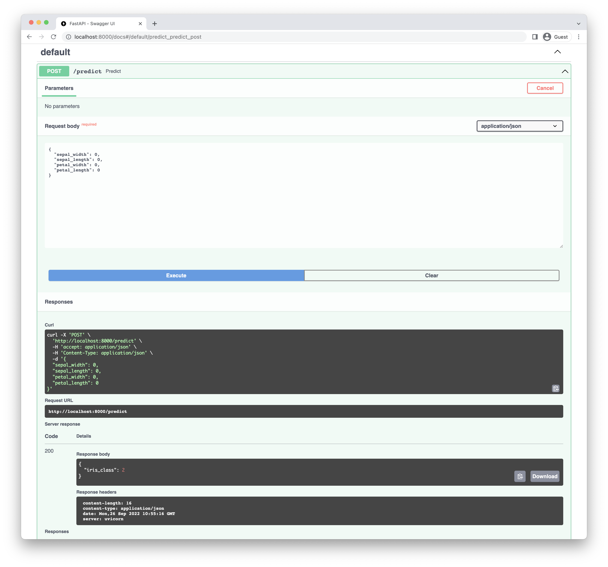

[Github](https://github.com/Aiden-Jeon/mle-mlops/tree/main/04_model_api) 에서 해당 내용에 대해서 확인할 수 있습니다.

## Overview
### 목표

- iris 데이터를 입력받아 예측할 수 있는 API를 작성합니다.

### 요구사항

1. `POST predict`/ & Request Body `{data}` 를 이용할 경우 모델의 예측값을 반환하는 API를 작성합니다.
    - API 명세서를 작성해봅니다.
2. `schemas.py` 에 Pydantic을 사용해 input_schema와 output_schema를 작성합니다.
    - input_schema: column 명은 앞선 db 챕터에서 작성한 이름을 기준으로 합니다.
    - output_schema
        - 모델의 결과를 `iris_class` 의 key값과 같이 반환합니다.
3. 작성한 내용으로 `crud.py`를 작성합니다.
4. 예측에 사용하는 모델은 mlflow에서 다운로드 받거나 바로 학습해서 사용해도 무관합니다.
    - 이 후 챕터에서는 mlflow에서 모델을 다운로드 받아서 사용하게 됩니다.
5. 작성된 `predict` API에 데이터를 전달해 예측값을 받아 봅니다.

---

## API Specification
iris 데이터를 입력으로 받는 명세서를 작성하면 다음과 같습니다.

- Header: `POST /predict`
- Request body:
    ```json
    {
        "sepal_width": 0,
        "sepal_length": 0,
        "petal_width": 0,
        "petal_length": 0
    }
    ```
- Response Body:
    ```json
    { 
        "iris_class": 2,
    }


## Schemas
입력으로 받을 input_schema와 예측값을 반환하는 output_schema를 작성합니다.

### Input Schema

입력으로 받는 값은 db에서 변환한 iris 의 column들 입니다.

```python
from pydantic import BaseModel


class PredictIn(BaseModel):
    sepal_width: float
    sepal_length: float
    petal_width: float
    petal_length: float
```

### Output Schema

반환하는 값은 모델의 예측값으로 그 key 값은 `iris_class` 입니다.

```python
class PredictOut(BaseModel):
    iris_class: int
```

## Crud
위에서 작성한 schema를 사용한 app 을 작성합니다.

### App
우선 필요한 패키지와 FastAPI를 사용하는 app을 작성합니다.

```python
import os

import mlflow
import pandas as pd
from fastapi import FastAPI

from schemas import PredictIn, PredictOut

app = FastAPI()
```

### Load Model
이제 예측에 사용할 모델을 불러와야 합니다. 매번 모델을 부르는건 비효율적이니 한 번만 불리도록 전역 변수로 설정합니다.  
다운로드 받은 모델이 위치하는 경로에서 모델을 불러올 수 있도록 합니다.  
여기서는 한 디렉토리 아래에 모델이 저장되어 있어서 아래와 같이 작성했습니다.

```python
MODEL = mlflow.pyfunc.load_model("../model/")
```

### POST
이제 predict 함수를 작성합니다.

```python
@app.post("/predict", response_model=PredictOut)
def predict(data: PredictIn):
    df = pd.DataFrame([data.dict()])
    pred = int(MODEL.predict(df))
    return PredictOut(iris_class=pred)
```

API를 통해 입력받는 값은 json 형태로 들어옵니다. 모델에서 예측을 하려면 numpy array 나 pandas dataframe 형태여야 하기 때문에 변환이 필요합니다.
`BaseModel.dict()` 를 사용하면 쉽게 python dictionary 형태로 바꿀 수 있습니다.

```python
>>> data.dict()
{
    "sepal_width": 0,
    "sepal_length": 0,
    "petal_width": 0,
    "petal_length": 0
}
```

이를 dataframe으로 변환합니다. 이 때 dataframe은 2차원의 형태의 데이터를 요구하기 때문에 list로 한번 감싸줍니다.
```python
>>> pd.DataFrame([data.dict()])
   sepal_width  sepal_length  petal_width  petal_length
0            0             0            0             0
```

이제 모델로 예측을 진행합니다. 모델로 예측을 할 경우 예측값은 numpy array로 나옵니다.
그런데 위에서 정의한 output_schema 에서는 int 를 입력해야 하기 때문에 int 로 변환 시켜줍니다.

```python
pred = int(MODEL.predict(df))
```

마지막으로 `PredictOut` schema에 값을 입력후 반환합니다.

```python
return PredictOut(iris_class=pred)
```

## 실행
uvicorn 을 이용해 app을 실행합니다.

```bash
uvicorn crud:app --reload
```

web에서 예제를 실행하면 다음과 같이 나옵니다.


