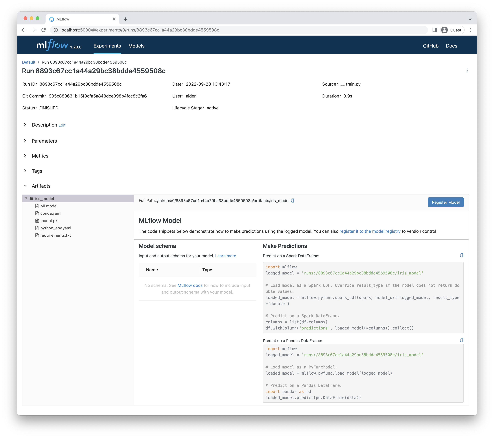

[Github](https://github.com/Aiden-Jeon/mle-mlops/tree/main/02_model_registry) 에서 해당 내용에 대해서 확인할 수 있습니다.

## Overview
### 목표

- 모델을 학습하고 mlflow server에 저장합니다.

### 요구사항

1. 앞선 챕터에서 추출한 데이터를 이용해 모델을 학습합니다.
    - eg) `from sklearn.svm import SVC`
    - 모델을 학습하는 스크립트의 위치는 mlflow server 가 띄어진 위치와 같아야 합니다.
        ```
        .
        ├── mlruns
        │   └── 0
        │       └── meta.yaml
        └── train.py
        ```
        
2. 학습이 끝난 모델을 built-in method를 사용해 mlflow server에 저장합니다.
    - Python의 `mlflow` 패키지를 이용합니다.
        - `pip install mlflow`
    - mlflow를 이용해 logging 하는 방법은 두 가지가 있습니다.
        1. fluent
        2. client [[MLFlow Client](https://www.mlflow.org/docs/latest/python_api/mlflow.client.html)]
    - mlflow에는 모델을 저장하는 방법은 두 가지가 있습니다.
        - artifact 처럼 다루기 [[MLFLow log_artifact](https://mlflow.org/docs/latest/python_api/mlflow.html#mlflow.log_artifact)]
        - built-in method 사용하기
            - [MLFlow built-in Model Flavors](https://www.mlflow.org/docs/latest/models.html#built-in-model-flavors)
            - [MLFLow pyfunc log_model](https://mlflow.org/docs/latest/python_api/mlflow.pyfunc.html#mlflow.pyfunc.log_model)
3. 저장된 모델을 mlflow website에서 확인합니다.
    - 모델이 어떻게 저장되어 있는지 확인합니다. [[MLFlow Storage Format](https://www.mlflow.org/docs/latest/models.html#storage-format)]

---

## Train

모델을 학습하는 스크립트를 작성합니다. 이 때 데이터는 이 전 챕터에서 사용한 데이터를 이용합니다.

```python
from sklearn.svm import SVC


X = df.drop(["id", "target"], axis="columns")
y = df["target"]
classifier = SVC()
classifier.fit(X, y)
```

## Save Model
mlflow를 사용할 수 있는 방법중 fluent 와 built-in method를 사용해 모델을 저장하겠습니다.


### Set Tracking URI
우선 앞선 챕터에서 띄운 mlflow server에 로깅할 수 있도록 `set_tracking_uri`를 이용해 mlflow 의 주소를 지정합니다.

```python
import mlflow


mlflow.set_tracking_uri("http://localhost:5000")
```

### Log Model
다음으로 built-in method 중 학습한 모델이 scikit-learn 모델이기 때문에 `mlflow.sklearn` 를 이용해 모델을 저장합니다.

```python
mlflow.sklearn.log_model(model, "iris_model")
```

위 명령어를 실행하면 다음과 같이 mlruns에 run_id 폴더가 생성되고 밑에 필요한 정보들이 추가됩니다.
```zsh
.
├── mlruns
│   └── 0
│       ├── 8893c67cc1a44a29bc38bdde4559508c
│       │   ├── artifacts
│       │   │   └── iris_model
│       │   │       ├── MLmodel
│       │   │       ├── conda.yaml
│       │   │       ├── model.pkl
│       │   │       ├── python_env.yaml
│       │   │       └── requirements.txt
│       │   ├── meta.yaml
│       │   ├── metrics
│       │   ├── params
│       │   └── tags
│       │       ├── mlflow.log-model.history
│       │       ├── mlflow.source.git.commit
│       │       ├── mlflow.source.name
│       │       ├── mlflow.source.type
│       │       └── mlflow.user
│       └── meta.yaml
└── train.py
```

## Web

[http://localhost:5000](http://localhost:5000) 에 접속하면 다음과 같이 나옵니다.


생성된 run을 클릭합니다.


위와 같이 artifacts에 `iris_model` 폴더 밑에 모델과 메타 정보들이 저장된 것을 확인할 수 있습니다.